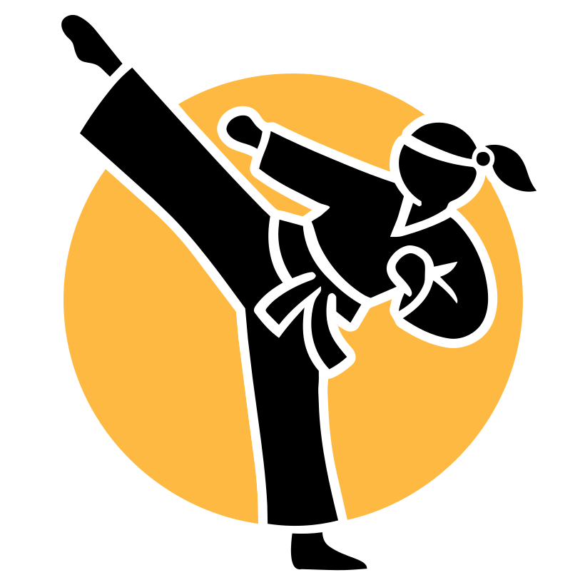

<p align="center">
  
</p>

<h1 align="center">Agent D.O.J.O.</h1>
<p align="center"><strong>Delegated Operations & Job Orchestration</strong></p>

<p align="center">
  A self-hosted AI agent orchestration platform for macOS.<br/>
  One primary agent manages squads of sub-agents, with a real-time dashboard for monitoring and control.
</p>

<p align="center">
  <a href="https://github.com/d-cornerpin/dojo/releases/latest"><strong>Download Installer (.pkg)</strong></a>
</p>

---

## What Is This?

Agent D.O.J.O. is a platform that lets you run a team of AI agents on your Mac. You give the primary agent a task — it plans, spawns sub-agents, delegates work, tracks progress, and reports back. Everything runs locally with a glassmorphism dashboard for real-time visibility.

Think of it as your own private AI operations center.

## Key Features

**Multi-Agent Orchestration**
- Primary agent (Sensei) manages the dojo
- PM agent tracks tasks, pokes stalled work, escalates issues
- Trainer agent creates reusable techniques
- Spawn squads of Ronin and Apprentice agents for parallel work
- Agents communicate, collaborate, and clean up after themselves

**Technique System**
- Agents learn reusable skills and save them as technique packages
- Techniques include step-by-step instructions, scripts, and templates
- Any agent can load and follow a published technique
- Build techniques interactively with the Trainer agent

**Project Tracker**
- Kanban board with drag-and-drop task management
- Scheduled and recurring tasks with dependency chains
- PM agent automatically monitors progress and escalates

**Multi-Provider AI**
- Anthropic (Claude) — API key or OAuth
- OpenAI (GPT-4o, o3, etc.)
- OpenRouter (thousands of models)
- Ollama (free local models)
- Smart router automatically selects the best model per task
- Ollama concurrency manager prevents RAM thrashing

**Dashboard**
- Glassmorphism UI with real-time WebSocket updates
- Chat with agents, view tool calls, upload files and images
- Agent cards with status, model, classification, and group
- System health monitoring (CPU, RAM, providers, Ollama)
- Cost tracking with budget alerts
- Memory browser with summary DAG visualization

**Communication**
- iMessage bridge — talk to your agents via text when away
- Presence toggle — "In the Dojo" vs "Away" modes
- Away mode forwards important messages through iMessage
- Watchdog sends alerts if the platform goes down

**Remote Access**
- Cloudflare Tunnel integration (quick or named tunnels)
- Access your dashboard from anywhere
- Zero-config quick tunnels or persistent custom domains

**Deployment**
- One-click `.pkg` installer for macOS
- launchd services with auto-restart
- Watchdog health monitor
- Menu bar app for quick access
- Automatic backups

## Screenshots

*Coming soon*

## Quick Start

### Option 1: macOS Installer (Recommended)

1. Download **[Agent-DOJO-Installer.pkg](https://github.com/d-cornerpin/dojo/releases/latest)**
2. Double-click to install
3. The setup wizard opens in your browser
4. Look for the 🥋 icon in your menu bar

### Option 2: From Source

```bash
git clone https://github.com/d-cornerpin/dojo.git
cd dojo
npm install
npm run dev
```

Open `http://localhost:3000` in your browser.

## Requirements

- macOS 13+ (Ventura or later)
- 8GB RAM minimum (16GB recommended for local models)
- Node.js 22+
- Internet connection for cloud AI providers

## Architecture

```
┌─────────────────────────────────────────────┐
│                  Dashboard                   │
│         (React + Tailwind + Vite)            │
├─────────────────────────────────────────────┤
│                 API Server                   │
│              (Hono + Node.js)                │
│  ┌─────────┐ ┌──────────┐ ┌──────────────┐  │
│  │ Agents  │ │ Tracker  │ │  Techniques  │  │
│  │ Runtime │ │  Engine  │ │    Store     │  │
│  └─────────┘ └──────────┘ └──────────────┘  │
│  ┌─────────┐ ┌──────────┐ ┌──────────────┐  │
│  │ Memory  │ │  Model   │ │   iMessage   │  │
│  │  Engine │ │  Router  │ │    Bridge    │  │
│  └─────────┘ └──────────┘ └──────────────┘  │
├─────────────────────────────────────────────┤
│              SQLite (WAL mode)               │
├─────────────────────────────────────────────┤
│    Watchdog    │    Menu Bar    │   Tunnel   │
└─────────────────────────────────────────────┘
```

## Agent Classifications

| Classification | Label | Behavior |
|---------------|-------|----------|
| Sensei | 🟡 Permanent | Cannot be dismissed. Core dojo agents. |
| Ronin | 🔵 Persistent | Survives restarts. Only the user can dismiss. |
| Apprentice | ⚪ Temporary | Auto-dismisses after timeout. |

## The Masters

Every dojo has three Sensei agents:

- **Dojo Master** — Your primary agent. Orchestrates everything.
- **Dojo Planner** — PM agent. Tracks tasks, pokes stalled work, escalates.
- **Dojo Trainer** — Creates and manages reusable techniques.

## Data & Privacy

- All data stored locally in `~/.dojo/`
- API keys encrypted at rest in `secrets.yaml`
- No telemetry, no cloud sync, no external analytics
- Your agents, your data, your machine

## Commands

```bash
~/.dojo/scripts/start.sh      # Start the server
~/.dojo/scripts/stop.sh       # Stop the server
~/.dojo/scripts/status.sh     # Check status
~/.dojo/scripts/backup.sh     # Backup your data
~/.dojo/scripts/uninstall.sh  # Uninstall everything
```

## Tech Stack

- **Backend:** Hono (Node.js), SQLite (better-sqlite3), WebSocket
- **Frontend:** React 18, Tailwind CSS, Vite
- **AI Providers:** Anthropic, OpenAI, OpenRouter, Ollama
- **Native:** Swift (menu bar app), launchd (services), AppleScript (iMessage)
- **Deployment:** pkgbuild/productbuild (.pkg installer)

## License

Copyright © 2026 Agent D.O.J.O. Contributors. All rights reserved.

---

<p align="center">
  <em>🥋 Enter the Dojo.</em>
</p>
